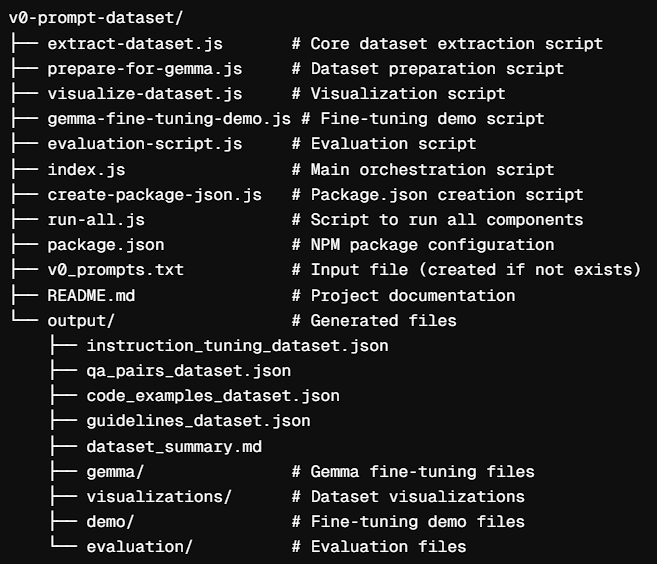

# **LLM Research & Enhancement**

### **Description**

This repo showcases a **research-level contribution** in fine-tuning, evaluating, & benchmarking **12+ LLMs** across **critical datasets**. The goal is to optimize model reasoning, factual accuracy, & performance against benchmarks set by **Google DeepMind** and try to outperform the metrics in official reports.

Additionally, this repo includes the **v0 System Prompts Custom Dataset (WIP)**—a side-project focused on transforming **Vercel’s open-sourced v0 system prompts** into a structured dataset for **LLM fine-tuning.**

---

## **Fine-Tuned & Benchmarked LLMs**

| Model                         | Dataset              | Task Type               |
| ----------------------------- | -------------------- | ----------------------- |
| **Google/Gemma-2B**           | OpenAI/GSM8K         | Instruction Fine-Tuning |
| **Google/Gemma-2B**           | StanfordNLP/IMDB     | Text Classification     |
| **Google/Gemma-2B**           | Google/BoolQ         | Question Answering      |
| **Google/Gemma-2B**           | Vicgalle/Alpaca-GPT4 | Instruction Fine-Tuning |
| **Google/Gemma-2-2B**         | OpenAI/GSM8K         | Instruction Fine-Tuning |
| **Google/Gemma-2-2B-IT**      | OpenAI/GSM8K         | Instruction Fine-Tuning |
| **Google/Gemma-2-9B**         | OpenAI/GSM8K         | Instruction Fine-Tuning |
| **Apple/OpenELM-3B-Instruct** | OpenAI/GSM8K         | Instruction Fine-Tuning |
| **Meta-Llama/Llama-3.2-3B**   | OpenAI/GSM8K         | Instruction Fine-Tuning |
| **Qwen/Qwen2-1.5B**           | OpenAI/GSM8K         | Instruction Fine-Tuning |
| **Qwen/Qwen2-0.5B-Instruct**  | OpenAI/GSM8K         | Instruction Fine-Tuning |
| **MistralAI/Mistral-7B-v0.1** | OpenAI/GSM8K         | Instruction Fine-Tuning |
| **TII/Falcon-3-1B-Base**      | OpenAI/GSM8K         | Instruction Fine-Tuning |
| **TII/Falcon-3-1B-Instruct**  | OpenAI/GSM8K         | Instruction Fine-Tuning |
| **OpenLLaMA/OpenLLaMA-3B**    | OpenAI/GSM8K         | Instruction Fine-Tuning |

---

## 🚧 Work in Progress: v0 System Prompts Custom Dataset

Recently, Vercel's v0 system prompts got open-sourced, And as I was fine-tuning & benchmarking LLMs with critical datasets, I thought why not craft a custom dataset out of System Prompts by Vercel Experts as a side-project.

This project is currently in development and aims to extract, structure, and fine-tune system prompts into a **custom dataset** optimized for training **LLMs like Gemma**. It is part of my **GSoC'25 Contributions for Google DeepMind**.

**Mentors, feel free to share your feedback or suggestions as I continue developing this dataset!**

### Project Structure v1.0

---

### **Final Thoughts**

- Grok 3 & GPT on scanning the official llm reports claim that many of my **fine-tuned models have outperformed the reported benchmarks**. However I remain skeptical until I receive **feedback** from **mentors, maintainers, or domain experts**. If validation is possible, it would greatly help refine these findings and contribute meaningfully to AI research.
- **I hope these contributions were meaningful in any way possible**. Regardless of the results, I really loved the process & being able to learn so much in such a short time I'm grateful to GSoC & Orgs like DeepMind.
- Feel free to connect for feedback or discussions! 😊
