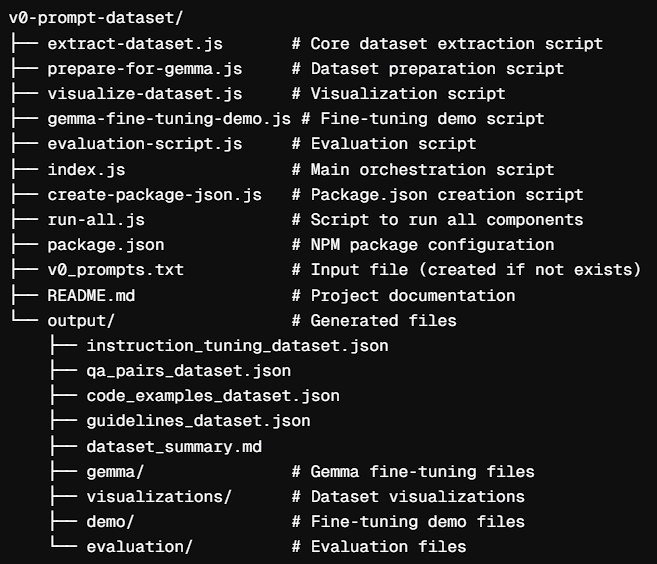

# 🚧 Work in Progress: v0 System Prompts Custom Dataset

Recently, Vercel's v0 system prompts got open-sourced, And as I was fine-tuning & benchmarking LLMs with critical datasets, I thought why not craft a custom dataset out of System Prompts by Vercel Experts as a side-project.

This project is currently in development and aims to extract, structure, and fine-tune system prompts into a **custom dataset** optimized for training **LLMs like Gemma**. It is part of my **Google Summer of Code (GSoC 2025) Contributions for Google DeepMind**.

**Mentors, feel free to share your feedback or suggestions as I continue developing this dataset!**

## 📂 Project Structure v1.0

